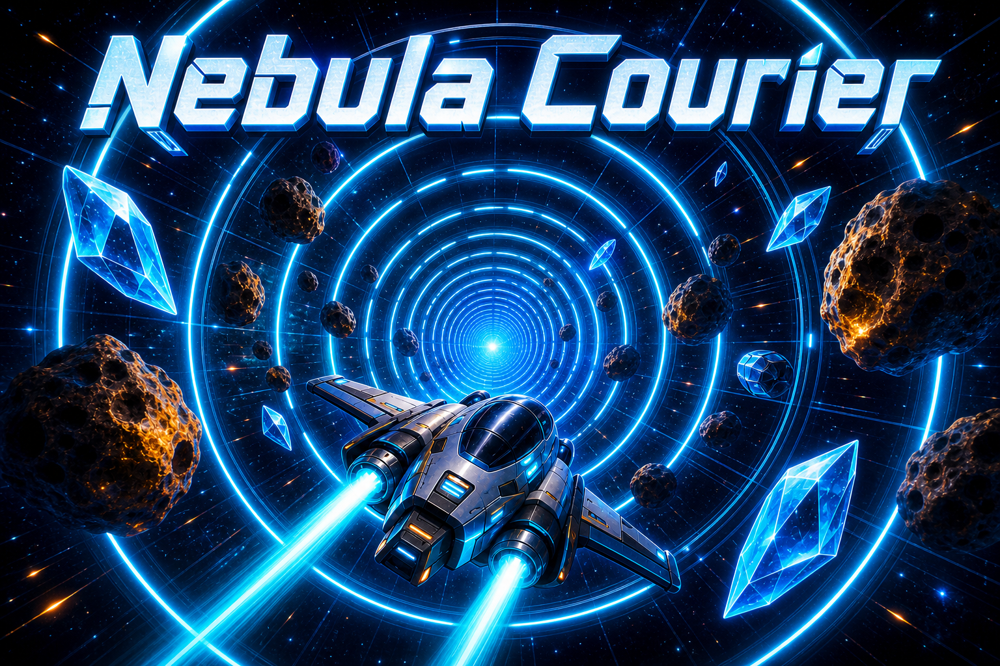

# Nebula Courier



Nebula Courier ist ein kleines 3D-Arcade-Spiel in Python. Du fliegst mit einem Raumschiff durch einen runden Sci-Fi-Tunnel, der entlang einer Kreisbahn verlaeuft. Dabei sammelst du Kristalle, weichst Asteroiden aus und nutzt Boost, um schneller durch den Tunnel zu kommen.

Das Spiel kommt ohne externe Python-Abhaengigkeiten aus. Es nutzt `tkinter`, das bei normalen Python-Installationen enthalten ist.

## Features

- 3D-Perspektive mit eigenem einfachen Renderer
- Runder Tunnel mit stationaeren Begrenzungsringen
- Kreisfoermige Tunnelbahn fuer mehr Bewegung im Raum
- Kristalle, Asteroiden, Score, Combo, Leben und Boost-Energie
- Tastatursteuerung mit `WASD` oder Pfeiltasten

## Starten

Am einfachsten per Doppelklick:

```bat
start_spiel.bat
```

Oder im Terminal:

```bat
cd ...\Spiel
start_spiel.bat
```

Alternativ direkt mit Python:

```bat
python spiel.py
```

Falls `python` auf deinem Rechner nicht erkannt wird, installiere Python 3 von https://www.python.org/downloads/ und aktiviere beim Installer die Option `Add python.exe to PATH`.

## Steuerung

- `WASD` oder Pfeiltasten: Raumschiff steuern
- `Space`: Boost
- `R`: Neustart nach Game Over oder Sieg
- `Esc`: Beenden

## Ziel

Sammle Kristalle, weiche Asteroiden aus und bringe den Nebelkurier bis Distanz 1400 durch den Tunnel.

## Dateien

- `spiel.py`: Hauptcode des Spiels
- `start_spiel.bat`: Startskript fuer Windows
- `cover_nebula_courier_round_tunnel.png`: Cover-Bild mit rundem Tunnel
